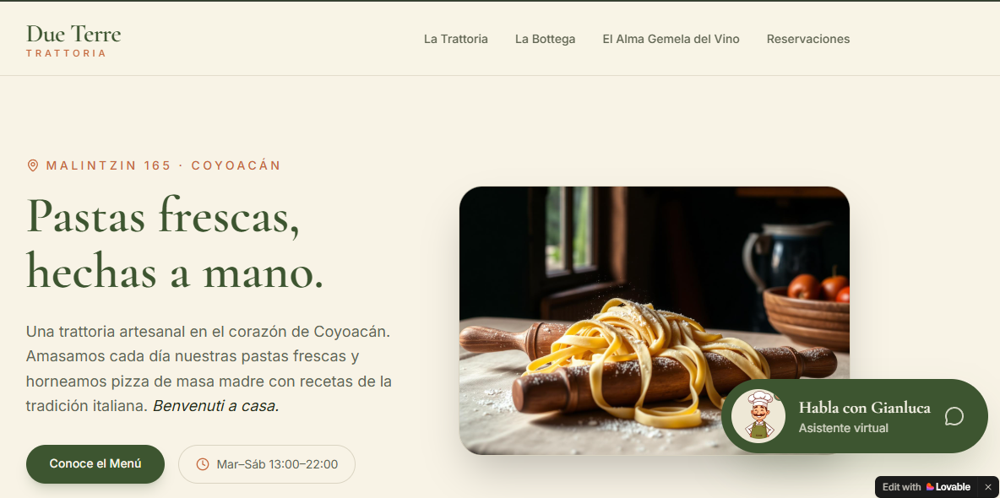

# Proyecto 1: El asistente que responde por tu negocio (Due Terre Trattoria)



## 📌 El Problema Real
Due Terre es una trattoria artesanal real ubicada en la calle Malintzin, Coyoacán, con una excelente propuesta gastronómica pero una presencia digital que no reflejaba su esencia rústica y de barrio. Además, el negocio forma parte de la importadora *Il Porto d'Italia* (en Francisco Sosa), un vínculo comercial potente que no estaba visibilizado en sus canales digitales.

## 🛠️ Solución Implementada
Diseñé una interfaz web minimalista que integra a **Gianluca**, un asistente virtual de IA entrenado para resolver dudas de clientes en tiempo real sin salir de la página.

### 🧠 Base de Conocimiento de la IA (Knowledge Base)
El asistente cuenta con un marco contextual estricto de 10 datos clave:
1.  **Concepto:** Pastas frescas hechas a mano y pizzas de masa madre.
2.  **Ubicación Exacta:** Malintzin 165 local 2a, Col. Del Carmen, Coyoacán.
3.  **Alianza Estratégica:** Conexión explícita con la tienda *Il Porto d'Italia* (Av. Francisco Sosa 9, Coyoacán).
4.  **Horarios:** Martes a Sábado (13:00 a 22:00 h), Domingos (13:00 a 19:00 h). Lunes cerrado.
5.  **Platos del Menú Integrados:** Precios y especialidades extraídos directamente del menú en código.
6.  **Contacto Directo:** Correo `info@dueterre.shop` y WhatsApp corporativo.
7.  **Platos destacados:** Lasagna alla Bolognese clásica y Fettuccine artesanal.
8.  **Reservas:** Se recomiendan para los fines de semana a través de su enlace oficial de WhatsApp.
9.  **Métodos de pago:** Efectivo, transferencias bancarias y tarjetas de débito/crédito principales.
10.  **Fiestas y Eventos privados:** Ofrecemos el espacio de la trattoria para eventos privados, comidas corporativas o celebraciones íntimas. Contamos con menús de degustación personalizados. Para cotizaciones, el cliente debe escribir directamente a nuestro correo oficial.
11. **Servicio a domicilio (Delivery):** Due Terre Trattoria cuenta con servicio a domicilio a través de la plataforma Rappi para que disfruten de nuestras pastas frescas y pizzas de masa madre en casa. Si un usuario pregunta en el chat, Gianluca debe confirmar que operamos mediante Rappi, pero aclarar que los pedidos se gestionan directamente desde la app de Rappi y no tomamos pedidos de delivery por este chat.

### 🛡️ Políticas Anti-Alucinación y UX
*   **Control de Incertidumbre:** Si el usuario pregunta algo fuera de la base de conocimiento (como estacionamiento o promociones del día), la IA se disculpa amablemente en un tono hospitalario y activa dinámicamente un componente web con un botón interactivo.
*   **Enlace Seguro:** El botón utiliza JavaScript nativo para redirigir directamente al API oficial de WhatsApp con un mensaje pre-llenado de reserva, evitando que el cliente quede varado en un enlace roto.
*   **Mapas Desplegables:** Implementación de modales emergentes al hacer clic en el símbolo de GPS para geolocalizar ambos locales en Coyoacán de forma fluida.

## 🔗 Enlace de Producción
👉 [Prueba el prototipo en vivo aquí](https://dueterre-trattoria.lovable.app)

## 📝 Ingeniería de Prompts (Prompt Engineering)

Para lograr que Gianluca tuviera una personalidad auténtica de Coyoacán, respetara estrictamente el menú y no alucinara al responder, utilicé la técnica de **System Prompting**. 

Aquí puedes ver los prompts clave que utilicé para entrenarlo y estructurar sus respuestas:

<details>
<summary><b>🤖 Ver el Prompt de Personalidad y Base de Conocimiento de Gianluca</b></summary>

```text
PROMPT 1
Crea una página web de una sola página (Landing Page) simple, elegante y minimalista para "Due Terre Trattoria". 

El diseño debe evocar un ambiente italiano auténtico y rústico-moderno, utilizando una paleta de colores basada en tonos crema, verde oliva profundo y sutiles toques terracota, con una tipografía Serif sofisticada para los títulos. 

La estructura de la página debe ser muy sencilla y contener únicamente:
1. Un encabezado con el logotipo/nombre "Due Terre Trattoria".
2. Una sección breve de bienvenida que mencione su ubicación en la calle Malintzin, Coyoacán, destacando sus pastas frescas hechas a mano.
3. Un banner destacado que anuncie su alianza con la tienda e importadora "Il Porto d'Italia" (ubicada en Francisco Sosa, Coyoacán), invitando a los clientes a conocer su "Bottega" de productos italianos selectos.

En la esquina inferior derecha, añade un widget de chat interactivo flotante y llamativo. Este chat es el núcleo de la página y representa a "Gianluca", el asistente virtual de la trattoria. 

Configura el chat de forma que responda a las interacciones de los usuarios basándose ESTRICTAMENTE en la siguiente base de conocimiento:

- CONCEPTO: Trattoria artesanal en Coyoacán famosa por sus pastas frescas hechas a mano y su pizza de masa madre.
- UBICACIÓN: Calle Malintzin, Coyoacán, Ciudad de México.
- ALIANZA Y TIENDA (LA BOTTEGA): Due Terre es parte de la prestigiosa importadora "Il Porto d'Italia" ubicada en la calle Francisco Sosa, Coyoacán. A través de ellos se pueden adquirir quesos, vinos y productos italianos auténticos.
- HORARIOS: Martes a Sábado de 13:00 a 22:00 h. Domingos de 13:00 a 19:00 h. Lunes cerrado.
- PLATOS DESTACADOS: Lasagna alla Bolognese clásica y Fettuccine artesanal.
- RESERVAS: Se recomiendan para los fines de semana a través de su enlace oficial de WhatsApp.
- MÉTODOS DE PAGO: Efectivo, transferencias bancarias y tarjetas de débito/crédito principales.
- REGLA ESTRICTA ANTI-ALUCINACIÓN: Si el usuario hace una pregunta sobre un dato que NO esté en esta lista (por ejemplo, precios exactos de los vinos, si se aceptan mascotas o si hay estacionamiento), Gianluca debe responder de manera muy amable en español con un toque italiano: "Lo lamento, no tengo esa información conmigo en este momento. Por favor, comunícate directamente a nuestro WhatsApp de atención para ayudarte."

PROMPT 2
Modifica la respuesta de Gianluca para cuando no sabe algo. En lugar de solo mencionar el WhatsApp, haz que proporcione el enlace directo cliqueable o el número. Usa este texto exacto para su respuesta de respaldo: "¡Ciao! Benvenuto. Lo lamento, no tengo esa información conmigo en este momento. Por favor, comunícate directamente a nuestro WhatsApp de atención haciendo clic aquí: https://wa.me/5215548416100 (o al enlace de su Linktree) para ayudarte con ese detalle. Grazie!"

PROMPT 3
El enlace de WhatsApp en el chat se rompe al hacerle clic. Modifica el código del componente del chat para que cuando Gianluca no sepa una respuesta, en lugar de poner un enlace de texto, muestre abajo de su mensaje un botón web real (un componente HTML de botón) que diga 'Hablar por WhatsApp'. Configura ese botón para que use la acción window.open('[https://wa.me/525543851724](https://wa.me/525543851724)', '_blank') de JavaScript, asegurando que redirija correctamente a la página real de WhatsApp en una pestaña nueva sin romper la aplicación.

PROMPT 4
Cambia la URL del botón de WhatsApp. En lugar de la anterior, haz que use exactamente este enlace oficial: [https://api.whatsapp.com/send?phone=5215548416100&text=Hola%20Dueterre%20Trattoria%20quiero%20hacer%20una%20reserva](https://api.whatsapp.com/send?phone=5215548416100&text=Hola%20Dueterre%20Trattoria%20quiero%20hacer%20una%20reserva). Asegúrate de que se mantenga el atributo para abrir en una pestaña nueva (_blank) para que no cierre nuestra página web.

PROMT 5
Cambia el botón que dice 'Conoce La Bottega' para que ahora diga 'Conoce el Menú'. Configúralo para que, al hacerle clic, abra una sección nueva o una pestaña limpia en la página donde se muestre de forma muy elegante y visual el menú de Due Terre. Aquí tienes los platos y precios exactos para que los estructures con v0: Menú
Servido diariamente entre la 1:30 - 22:00 hs
MENU

PROMPT 6
Por favor, realiza las siguientes actualizaciones estructurales en la página y actualiza el conocimiento de Gianluca (el asistente de IA) para que recuerde perfectamente cada uno de estos datos modificados:

1. ACTUALIZACIÓN DE DATOS EN EL HOME Y EN EL CONOCIMIENTO DE GIANLUCA:
- Modifica la dirección física de Due Terre por: "Malintzin 165 local 2a, Col Del Carmén, Coyoacán".
- Modifica los datos de contacto por: Correo electrónico: "info@dueterre.shop" y WhatsApp: "55 4841 6100".
- Modifica la dirección de la tienda aliada por: "Il Porto d'Italia: Av. Francisco Sosa 9, Coyoacán, 04000 Ciudad de México, CDMX".

2. MENU INTEGRADO:
- Asegúrate de que Gianluca conozca a la perfección todos los platos y precios del menú que acabamos de agregar para que responda con total precisión si un cliente le pregunta en el chat.

3. MAPAS EMERGENTES INTERACTIVOS:
- Justo donde se colocó el símbolo de GPS de la dirección, añade la funcionalidad de que al hacer clic se despliegue una ventana emergente (modal/pop-up) elegante con un mapa de ubicación.
- Integra esta ventana emergente tanto para la dirección de Malintzin (Due Terre) como para la de Francisco Sosa (Il Porto d'Italia), usando un mapa interactivo o una simulación visual estética integrada que actúe como mapa.

4. SECCIÓN IL PORTO D'ITALIA:
- En el banner o sección de Il Porto d'Italia, incluye un botón estético que diga "Visitar la Bottega Oficial" y que dirija a la URL oficial: https://www.ilportoditalia.com/ configurado para que abra en una pestaña nueva (_blank).

5. REGLAS REFORZADAS PARA GIANLUCA:
- Gianluca debe tener presente en todo momento que el correo oficial es info@dueterre.shop, el WhatsApp es 55 4841 6100 y debe dominar las nuevas direcciones exactas de ambos locales para guiar correctamente a los comensales si le preguntan cómo llegar.

PROMPT 7
Por favor, añade estos datos a la base de conocimiento de Gianluca y agrega una mención visual muy atractiva en la página:

-SERVICIO A DOMICILIO (DELIVERY): Due Terre Trattoria cuenta con servicio a domicilio a través de la plataforma Rappi para que disfruten de nuestras pastas frescas y pizzas de masa madre en casa. Si un usuario pregunta en el chat, Gianluca debe confirmar que operamos mediante Rappi, pero aclarar que los pedidos se gestionan directamente desde la app de Rappi y no tomamos pedidos de delivery por este chat.
-EVENTOS Y FIESTAS PRIVADAS: Due Terre ofrece la organización de eventos privados, comidas corporativas y celebraciones íntimas en el local con menús de degustación personalizados. Para solicitar una cotización, los clientes deben escribir al correo oficial info@dueterre.shop.
```
</details>


