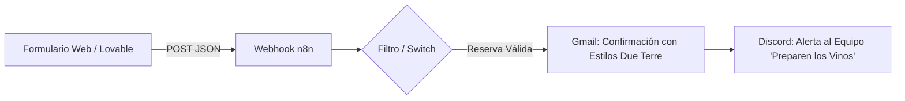
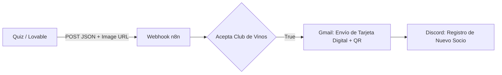

# 🍇 Proyecto 4: Automatización de Flujos y Acciones Encadenadas (n8n)

Este repositorio contiene la arquitectura de automatización backend desarrollada en **n8n** para procesar y ejecutar acciones automáticas a partir de los datos capturados en el sitio web de **Due Terre Trattoria** (Proyecto 1/2) y la aplicación interactiva **El Alma Gemela del Vino** (Proyecto 3).


---

## 🚀 Descripción del Proyecto

El objetivo principal de este proyecto es conectar el frontend desarrollado en **Lovable** y la base de datos en **Supabase** con flujos de trabajo automatizados en **n8n**, desencadenando un mínimo de **3 acciones encadenadas por cada flujo** cuando un usuario interactúa con la plataforma.

Se implementaron dos workflows independientes en n8n:

1. **Workflow 1:** Sistema de Confirmación y Notificación de Reservaciones.
2. **Workflow 2:** Expedición de Tarjeta Digital de Fidelidad y Alta en el Club de Vinos.

---

## 🛠️ Tecnologías Utilizadas

* **n8n Cloud:** Plataforma de automatización e integración de flujos de trabajo mediante Webhooks.
* **Lovable / Frontend (React + Tailwind):** Captura de datos de usuarios en el cliente.
* **Supabase:** Base de datos PostgreSQL para almacenamiento y persistencia de información.
* **Gmail API:** Envío automatizado de correos transaccionales y confirmaciones en formato HTML personalizado.
* **Discord Webhooks:** Notificaciones internas en tiempo real para el equipo de la trattoria.

---

## ⚡ Flujos de Automatización

### 🍕 1. Workflow de Reservación de Mesa (Due Terre Trattoria)

Desencadenado desde el formulario de reserva de mesa del sitio web.



* **Acción 1:** Recepción y validación del *payload* HTTP enviado por Lovable.
* **Acción 2:** Envío de correo electrónico transaccional mediante Gmail con plantilla HTML maquetada según la identidad visual de Due Terre (colores oliva `#384e36`, terracota y fondo cálido).
* **Acción 3:** Notificación en tiempo real al canal de Discord del personal del restaurante indicando los datos del comensal, fecha, hora y turno asignado.

---

### 🍷 2. Workflow "El Alma Gemela del Vino" (Club de Fidelidad)

Desencadenado al finalizar el quiz interactivo de maridaje de vino.



* **Acción 1:** Captura del payload con los datos del usuario, el vino asignado y la imagen renderizada de la **Tarjeta Verde de Fidelidad (Fidelity Card)** con su código QR.
* **Acción 2:** Generación y envío por Gmail del pase exclusivo con la tarjeta digital incrustada para ingresar a la cata.
* **Acción 3:** Envío de notificación al canal de Discord para el seguimiento de nuevos socios registrados en el Club Due Terre.

---

## 🎨 Especificaciones del Frontend y Estilos HTML

Para garantizar la consistencia de marca, los correos enviados desde n8n fueron diseñados con **CSS inline** respetando la paleta de colores de la trattoria:

* **Verde Oliva:** `#384e36`
* **Terracota / Acento:** `#b85c37`
* **Fondo Cálido / Crema:** `#f7f4eb`
* **Texto Oscuro:** `#2c2c2a`

---

## 🐛 Resolución de Bugs y Aprendizajes Técnicos (Troubleshooting)

Durante la integración de las automatizaciones en **n8n** se presentaron dos inconvenientes principales en la renderización y mapeo de datos hacia **Gmail** y **Discord**. A continuación se detalla el diagnóstico y la solución implementada:

### 1. Formateo de Expresiones y HTML en Gmail
* **Inconveniente:** El cuerpo del correo enviaba las variables en texto plano (ej. `{{ $json.body.nombre }}`) sin evaluar el código ni renderizar el diseño.
* **Causa:** Confusión en la interfaz de n8n al intentar forzar el modo `fx` directo en lugar de configurar el parámetro de entrada correcto.
* **Solución:** Se cambió el tipo de mensaje a **HTML** y se activó el modo **Expression**. Esto permitió redactar la plantilla con código HTML y CSS *inline* evaluando dinámicamente las variables JSON enviadas desde el Webhook de Lovable.

### 2. Mapeo y Jerarquía de Datos en Discord
* **Inconveniente:** Las variables dinámicas del usuario no se enviaban en la notificación del canal de Discord.
* **Causa:** Desalineación en la ruta del objeto JSON debido a la estructura de la carpeta raíz del nodo **Webhook**.
* **Solución:** Se seleccionó el modo **Expression** en el mensaje de Discord y se arrastraron directamente los nodos del JSON desde el panel dinámico de *INPUT* (`$json.body...`) hacia el cuerpo del texto, garantizando que el *payload* tomara la ruta exacta de la propiedad recibida.

---

## 🔗 Enlace de Producción
👉 [Prueba el prototipo en vivo aquí](https://dueterre-trattoria.lovable.app)

## 📂 Prompts Utilizados en el Desarrollo

> *En esta sección se detallan los prompts clave utilizados durante la integración de Lovable con n8n.*

<details>
<summary><b>💬 1. Reservacion de mesa: Conexión del Webhook de Lovable a n8n</b></summary>

```text
Hola, quiero conectar el formulario de Reserva de Mesa con mi automatización en n8n.
Cuando el usuario envíe el formulario, realiza un fetch con método POST a esta URL: https://huguettelopez.app.n8n.cloud/webhook/f8ea409d-1246-4aa5-ba9f-ac84c1e5f208.
Envía en el body un JSON con los siguientes campos:
nombre
email
fecha
hora
personas
turno

```
</details>


<details>
<summary><b>💬 2. El alma gemela del vino: Conexión del Webhook de Lovable a n8n</b></summary>

```text
PROMPT 1
Quiero conectar el formulario de suscripción a "El Alma Gemela del Vino" (Club Due Terre) con mi automatización en n8n.
Cuando el usuario complete el quiz y envíe sus datos para recibir su Tarjeta de Fidelidad Digital, realiza un fetch con método POST a la URL de mi Webhook de n8n: https://huguettelopez.app.n8n.cloud/webhook/b1d47def-648b-4b9b-84f5-ea26373e9818
Asegúrate de enviar en el body de la petición un objeto JSON plano (convertido con JSON.stringify y con encabezado 'Content-Type': 'application/json') con los siguientes campos exactos:

{
  "nombre": "nombre_del_usuario",
  "email": "correo_del_usuario",
  "vino_asignado": "nombre_del_vino_resultado",
  "club_vinos": true
}

Asegúrate de que el envío se realice de forma asíncrona sin bloquear la confirmación visual de la tarjeta para el usuario en la pantalla.

PROMPT 2
Actualiza la función que envía los datos al webhook de n8n tras completar el quiz de "El Alma Gemela del Vino".

Además de enviar nombre, email, vino_asignado y club_vinos, necesito que incluyas en el JSON del body la propiedad:
"imagen_tarjeta": "URL_DE_LA_IMAGEN_O_QR_DE_LA_TARJETA"

Asegúrate de enviar la URL pública de la imagen o del código QR generado para la tarjeta de fidelidad digital, de modo que el body quede estructurado así:

{
  "nombre": nombre,
  "email": email,
  "vino_asignado": vino_asignado,
  "club_vinos": true,
  "imagen_tarjeta": url_de_la_tarjeta_o_qr
}

PROMPT 3
Actualmente el webhook a n8n solo está enviando la imagen del código QR individual. Necesito que envíe la imagen COMPLETA de la tarjeta verde de fidelidad (Fidelity Card).

Por favor, ajusta la lógica de envío para que:
1. Capture o renderice todo el componente visual de la tarjeta de fidelidad verde (que incluye el encabezado 'Fidelity Card', el nombre del socio, el vino asignado, la descripción, el número de folio y el código QR).
2. Convierta ese contenedor/componente completo en una imagen (o genere la URL/Data URL correspondiente).
3. Envíe la propiedad 'imagen_tarjeta' en el JSON del webhook apuntando a la imagen completa de la tarjeta verde, no solo al QR.

Estructura requerida en el body del webhook:
{
  "nombre": nombre,
  "email": email,
  "vino_asignado": vino_asignado,
  "club_vinos": true,
  "imagen_tarjeta": "URL_O_DATA_DE_LA_TARJETA_VERDE_COMPLETA"
}
```
</details>
